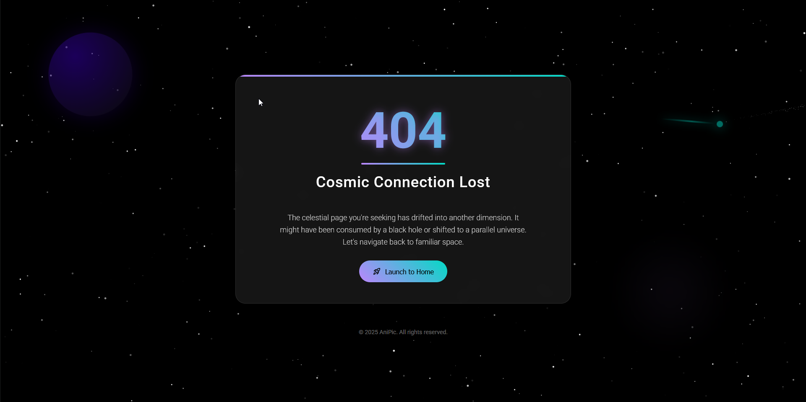

# Cosmic 404 - Lost in Space



> An interstellar 404 error page with animated starfield, floating planets, and a spectacular comet

Cosmic 404 transforms the standard "Page Not Found" error into an immersive space exploration experience. Featuring a dynamic starfield animation, celestial objects, and a comet with particle effects, this page turns a frustrating moment into a visual journey through the cosmos.

## Features

- 🌌 **Animated Starfield** - Dynamic star background using Canvas API
- ☄️ **Realistic Comet** - With core, tail, and particle trail effects
- 🪐 **Floating Cosmic Objects** - Planet and nebula with subtle animations
- ✨ **Material Design Elements** - Modern UI with smooth transitions
- 📱 **Fully Responsive** - Works on all device sizes
- 🚀 **Interactive Rocket Button** - With ripple effect animation

## How to Use

1. Clone the html:
```bash
git clone https://github.com/beleshko/Cosmic-404-Lost-in-Space/404.html
```
Open 404.html in your browser

## GitHub Pages Setup

To use this as your GitHub 404 page:
```
    Add 404.html to your repository root

    Enable GitHub Pages in your repository settings:

        Source branch: main

        Source folder: /root
```
Customization

Easily customize the page by modifying:

    Colors in the :root CSS variables

    Text content in the HTML

    Starfield parameters in JavaScript

    Homepage URL for the rocket button

CSS variables:
```css 
/* Change color scheme */
:root {
  --primary: #FF6B6B;
  --primary-variant: #C73E1D;
  --secondary: #4ECDC4;
  /* ... */
}
```

JavaScript parameters:

```javascript
// Modify starfield
const starCount = 600; // Increase star density

// Change home URL
document.getElementById('homeBtn').addEventListener('click', function() {
  window.location.href = 'https://your-homepage.com';
});
```

Technologies Used

    HTML5

    CSS3 (Animations, Variables, Gradients)

    JavaScript (Canvas API)

    Google Fonts

    Material Icons

## Preview

[Desktop](https://github.com/beleshko/Cosmic-404-Lost-in-Space/blob/main/screenshot-desktop.png)	[Mobile](https://github.com/beleshko/Cosmic-404-Lost-in-Space/blob/main/screenshot-mobile.png)

## License

Distributed under the MIT License. See LICENSE for more information.

Make your 404 errors an out-of-this-world experience! 🚀
